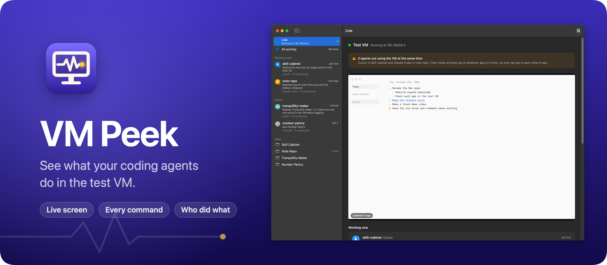
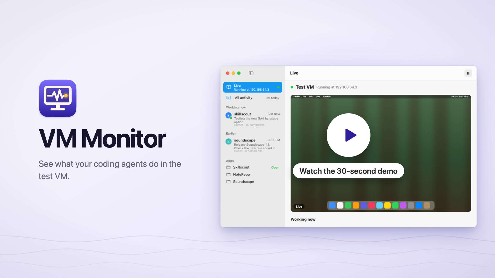
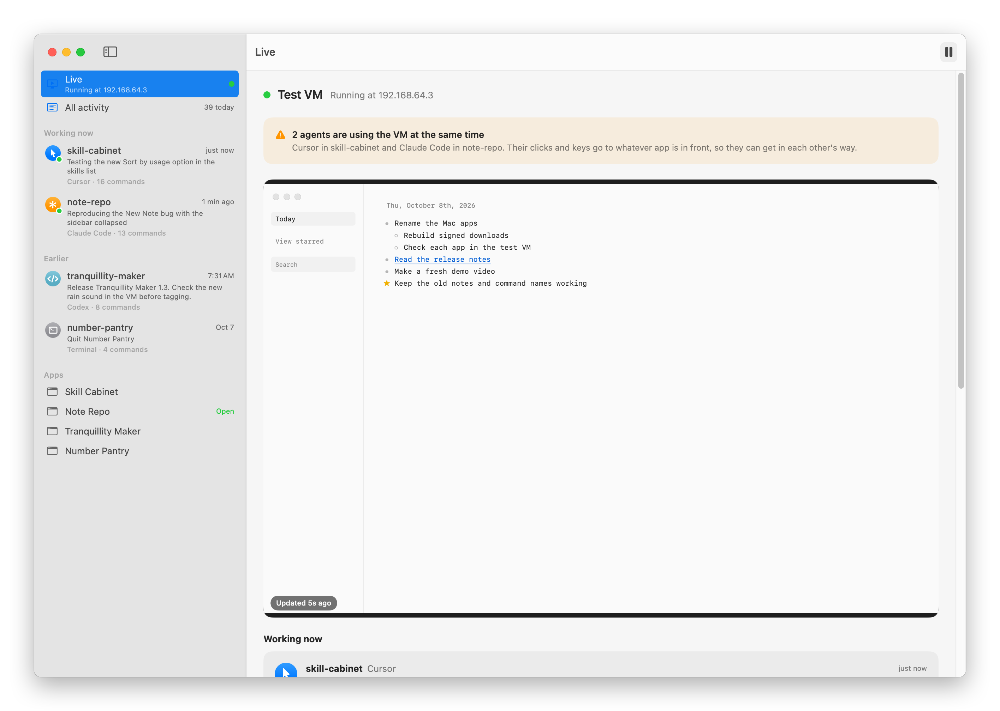
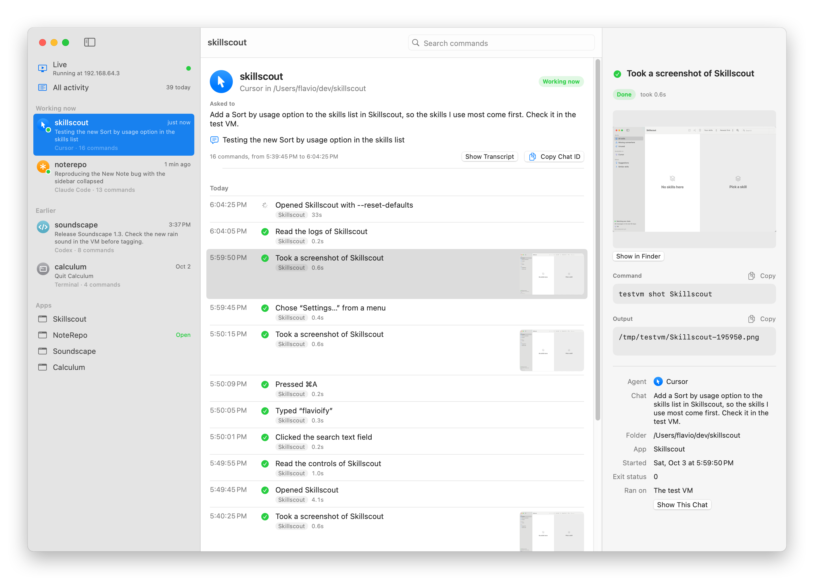

VM Monitor shows what your coding agents do in a macOS test VM. You see the VM's screen live, which agents are using it right now and for what, and every command each of them ran.

I let coding agents test my Mac apps in a virtual machine, so they never take over my screen while I work. The catch is that I couldn't see what they did in there, or notice when two of them were in the VM at the same time. VM Monitor is the window into that VM.

Here's VM Monitor in 30 seconds:

[](https://flaviocopes.com/images/vm-monitor/demo.mp4)

## Download

Get `VM-Monitor-1.0.0.zip` from the [latest release](https://github.com/flaviocopes/vm-monitor/releases/latest), unzip it, and drag VM Monitor to your Applications folder. It runs on macOS 15 Sequoia or later, on Apple silicon and Intel Macs.

### Opening it the first time

VM Monitor is signed with my Apple Developer ID and notarized by Apple. The first time you open it, macOS asks if you're sure you want to open an app downloaded from the internet. Click **Open**.

On a work laptop you might not be able to install apps in `/Applications`. You can keep VM Monitor in the `Applications` folder inside your home folder instead.

### Updates

Once a day, VM Monitor asks GitHub whether there's a newer version. When there is, it shows what's new, and **Install and Relaunch** puts it in place of the old one. **VM Monitor → Check for Updates…** checks right away.

To turn off the daily check, run this in Terminal:

```sh
defaults write com.flaviocopes.vm-monitor AppUpdaterAutomaticChecks -bool false
```

## Set up the test VM

VM Monitor watches a VM driven by [testvm](https://github.com/flaviocopes/testvm), a shell script with its own repo. Agents use it to open, screenshot and click through your app in the VM, and it logs every command they run. The VM runs under [Tart](https://tart.run), which needs an Apple silicon Mac.

Install Tart, then put `testvm` somewhere in your `PATH`:

```sh
brew install cirruslabs/cli/tart
curl -Lo /opt/homebrew/bin/testvm https://github.com/flaviocopes/testvm/releases/latest/download/testvm
chmod +x /opt/homebrew/bin/testvm
```

Then create the VM. It downloads Cirrus Labs' macOS Sequoia image, about 25 GB, and gives the VM 4 cores and 8 GB of memory:

```sh
testvm setup
```

From then on, `testvm open MyApp.app` copies a build into the VM and launches it there, `testvm shot MyApp` takes a screenshot, and `testvm help` lists the rest. Agents can say what they're testing with `testvm note 'Checking the new sort menu'`.

Tell your agents to use it, with a rule like this in Cursor's rules, `~/.codex/AGENTS.md` or `~/.claude/CLAUDE.md`:

```markdown
When you test a Mac app you built, never launch, relaunch, quit, screenshot
or click through it on this Mac. Do all of that in the test VM with `testvm`.
Start with `testvm note` to say what you're testing.
```

To test on a real Mac instead, like a Mac mini on your network, put `TEST_HOST=mini.local` and `TEST_USER=<you>` in `~/.config/testvm/config`. `testvm` and VM Monitor both use it. The [testvm README](https://github.com/flaviocopes/testvm#test-on-another-mac) shows how to set up that Mac, and has an agent skill for `testvm`.

## Features

- **Live view.** The VM's screen, refreshed every 2 seconds while the window is visible. Under it, every agent that used the VM in the last 3 minutes, with the prompt of its chat, the note it left and the command it's running.
- **A warning when agents overlap.** When two chats use the VM at once, a banner says so, because their clicks and keys go to whatever app is in front.
- **Every command in plain words.** "Opened Skillscout", "Clicked “Find repeated tasks”", "Pressed ⌘A". A click gets the name of the control it hit, from the list of controls the agent read just before.
- **A timeline per chat and per app.** Each chat shows the prompt that started it. Each app shows who put the latest build in the VM.
- **The whole story of a command.** Click one to see its screenshot, the exact command line, what it printed and who ran it.
- **Search** across every command.
- **Cursor, Claude Code and Codex**, told apart automatically. Anything run from a terminal shows up as you.

<picture>
  <source media="(prefers-color-scheme: dark)" srcset="docs/screenshot-dark.png" />
  
</picture>

<picture>
  <source media="(prefers-color-scheme: dark)" srcset="docs/chat-dark.png" />
  
</picture>

## Privacy

VM Monitor reads files on your Mac: the log `testvm` writes in `~/Library/Logs/testvm`, and the first message of each agent chat, from Cursor's, Codex's and Claude Code's own transcript folders. It connects to the VM over SSH, with `testvm`'s key, to grab its screen and list the open apps. It never clicks, types or opens anything in the VM. Once a day, it asks GitHub whether there's a newer version of VM Monitor, and it downloads one only when you click **Install and Relaunch**. There are no accounts.

## Build it from source

You need macOS 15 or later and Xcode 26.

```sh
swift test
Scripts/build-app.sh
```

The app is in `dist/VM Monitor.app`. To build the release zip, run:

```sh
Scripts/build-release.sh
```

It builds a universal app and zips it into `dist/`. With my Developer ID certificate in the keychain it signs and notarizes the app. Everywhere else it signs it ad hoc, so your copy is signed ad hoc. A copy you build yourself opens without a warning on your Mac.

If you send it to another Mac, macOS says it "could not verify VM Monitor is free of malware". Click **Done**, then go to **System Settings → Privacy & Security** and click **Open Anyway**, or remove the quarantine flag in Terminal:

```sh
xattr -dr com.apple.quarantine "/Applications/VM Monitor.app"
```

## Development

`Scripts/screenshot.sh` renders the README screenshots from the real views, in the test VM, with a made-up history. `swift Scripts/render-banner.swift` draws the banner and `swift Scripts/render-icon.swift Assets/AppIcon.png` the icon.

Working with an AI coding agent? Point it at [AGENTS.md](AGENTS.md). It has the commands and the rules to follow.

## How it works

`testvm` writes two lines to `~/Library/Logs/testvm/activity.jsonl` for every command, one when it starts and one when it ends:

```json
{"v":1,"event":"start","id":"20261003-190422-80779","time":1791047062.617,"pid":80779,"command":"shot","args":["Skillscout"],"cwd":"/Users/flavio/dev/skillscout","agent":"cursor","session":"01a3ecad-…","target":"vm"}
{"v":1,"event":"end","id":"20261003-190422-80779","time":1791047062.883,"status":0,"last":"/tmp/testvm/Skillscout-190422.png"}
```

It tells the agents apart from their environment. Cursor sets `CURSOR_CONVERSATION_ID` and Codex sets `CODEX_THREAD_ID`. Claude Code sets neither, so `testvm` looks for the `claude` process up the process tree. What a command prints goes to `runs/<id>.txt`. VM Monitor reads the new lines every second, and finds each chat's first prompt in the agent's transcripts to say what it's working on.

## License

[MIT](LICENSE)
